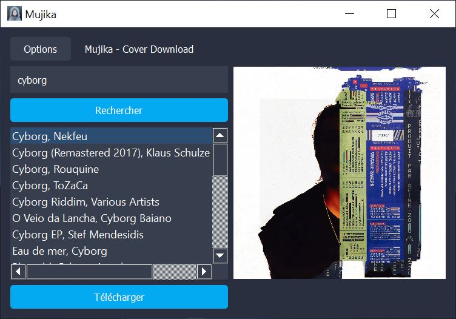

 

# Mujika - Cover Downloader

## L'application de téléchargement de cover d'album en haute qualité

Mujika est une application multi-plateforme de téléchargement de pochettes d'albums en haute qualité. Grâce à une simple recherche vous avez accès à tout les albums disponibles sur les plateformes de streaming !

Voici un exemple de recherche de l'album *Cyborg* de Nekfeu :



Après avoir cliqué sur le bouton **Télécharger** ou double-cliqué sur l'album, la pochette sera directement téléchargé dans un dossier *albums* sur votre bureau.

## Téléchargement

[MujikaSetup.exe](https://github.com/ldxdev/mujika-cover-download/releases/tag/exe)

[Mujika.zip](https://github.com/ldxdev/mujika-cover-download/releases/tag/folder)

## Fontionnement

L'application est développé en Python grâce aux librairies *PySide2* et *fbs* afin de permettre une comptabilité sur Windows, MacOS et Linux.
La partie API est quand à elle développé grâce aux librairies *deezer-python* et *urllib*.

Lorsque l'utilisateur fait une recherche, l'application fait une requete à l'API de Deezer afin de répupérer un dictionnaire contenant des dictionnaire de ce type :

```json
{14720858: {"title": "Cyborg", "artist": "Nekfeu", "cover": "https://e-cdns-images.dzcdn.net/images/cover/9ec588b46ba05c45272943ef0a7174a6/1000x1000-000000-80-0-0.jpg"}}
```
On récupère donc les informations de l'album à afficher à l'utilisateur ainsi que l'URL de la pochette en qualité *xl* ([voir l'API de Deezer](https://developers.deezer.com/api/album)). L'identifiant utilisé pour les clés des dictionnaires est l'identifiant unique à chaque album présent sur Deezer afin d'éviter tout problèmes pour des albums ayant le même nom.

Une fois que l'utilisateur clique sur **Télécharger**, l'application télécharge l'image grâce à la librairie *urllib* de Python dans un dossier sur le bureau.

## Liens utiles

- [API officiel de Deezer](https://developers.deezer.com/api)
- [Deezer Python Client](https://deezer-python.readthedocs.io/en/stable/)
- [Documentation PySide2](https://doc.qt.io/qtforpython-5/PySide2/QtWidgets/index.html)
